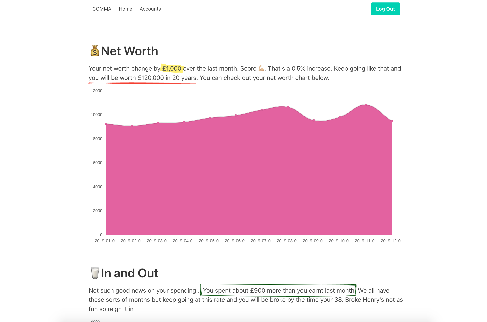
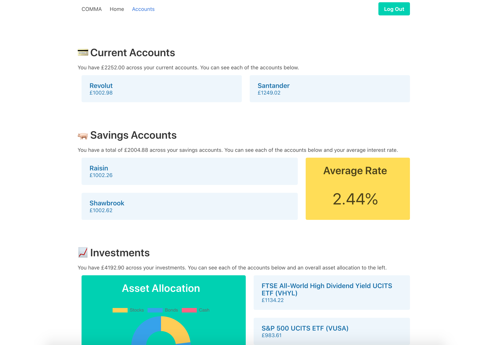

# Comma
Welcome to Comma, a open-source web application to help you get your finances in order. The project is still in beta mode so if you would like to collaborate, get in touch.

Comma aims to make managing your financial situation easy and intuitive

### Homepage

### Accounts Page

## 💻 Installing locally 
1. Clone the repo onto your computer `git clone https://github.com/blackhaj/Comma`
2. Run `npm i` from inside the root directory
3. Run `npm run dev`

## Author
Henry Black - [Github](https://github.com/blackhaj) | [LinkedIn](https://www.linkedin.com/in/henryblack1/)  

## Contact
You can contact me personally through the details on my [Github](https://github.com/blackhaj) profile

## Contributing
I would love for you to try out the app and submit any issues you encounter. Feel free to fork to your own repo and submit PRs. Some features I would like to add:
1. Utilize external balance APIs such as Bud or Truelayer
2. Better security
3. More detailed but dynamic (hence scalable) account insights

### License
This project is licensed under the MIT License - see the [LICENSE](LICENSE) file for details
